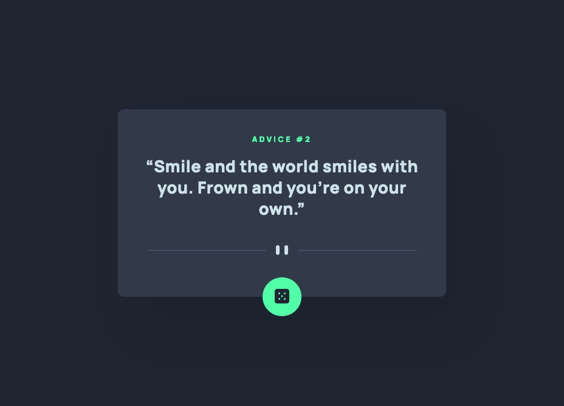

# Frontend Mentor - Advice generator app solution

This is a solution to the [Advice generator app challenge on Frontend Mentor](https://www.frontendmentor.io/challenges/advice-generator-app-QdUG-13db). Frontend Mentor challenges help you improve your coding skills by building realistic projects.

## Table of contents

- [Overview](#overview)
  - [Screenshot](#screenshot)
  - [Links](#links)
- [My process](#my-process)
  - [Built with](#built-with)
  - [What I learned](#what-i-learned)
  - [Useful resources](#useful-resources)
- [Author](#author)

## Overview

### Screenshot

### Links

- Solution URL: [Github](https://github.com/graficdoctor/fe-20-advice-generator-app)
- Live Site URL: [Vercel](https://fe-20-advice-generator-app.vercel.app/)

## My process

### Built with

- Semantic HTML5 markup
- CSS custom properties
- CSS Grid
- Mobile-first workflow

### What I learned

I've been learning all week on how to work with API's and JSON-files. This was a nice excercise to put that what I learned into a real thing.

### Useful resources

- [Creating Glow Effects with CSS](https://codersblock.com/blog/creating-glow-effects-with-css/) - I had a look here on how to write the glowing shadow for the button. The diagram on the website really helped me to adapt my code.
- [Responsive images](https://developer.mozilla.org/en-US/docs/Learn/HTML/Multimedia_and_embedding/Responsive_images) - This is the first time I used the `<picture>`-element. While I actually had the intention of using `srcset` I noticed upon reading `picture` would be better.

## Author

- Frontend Mentor - [@graficdoctor](https://www.frontendmentor.io/profile/graficdoctor)
- Twitter - [@graficdoctor](https://www.twitter.com/graficdoctor)
